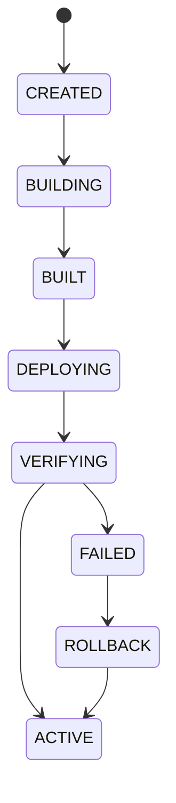

# Application Deployment Architecture

**Document ID:** ARC-APP-DEPLOYMENT-001  
**Version:** 1.0  
**Status:** Approved  
**Classification:** Internal Architecture  

---

## 1. Introduction
The Deployment Engine coordinates updating tenant workloads without interrupting operational runtime flows.

## 2. Deployment Strategies
- **Rolling Strategy (Start-Verify-Stop)**:
  1. Boot new version container instances.
  2. Verify readiness using liveness/readiness probes.
  3. Redirect Traefik routing to the new container endpoints.
  4. Spin down and clean up old instances.
- **Recreate Strategy (Stop-then-Start)**:
  1. Spin down all existing application containers.
  2. Boot the new version container instances.
  3. Verify health and accept traffic.

## 3. Finite State Machine (FSM)
Application updates follow a rigid state machine workflow:
`CREATED` -> `BUILDING` -> `BUILT` -> `DEPLOYING` -> `VERIFYING` -> `ACTIVE` or `FAILED`.

