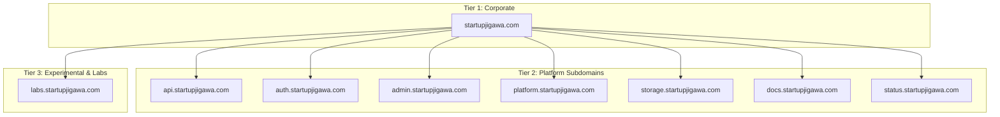
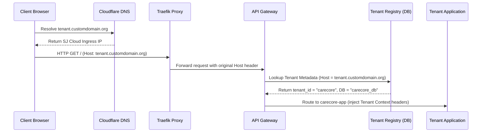

# DNS Architecture

**Document ID:** ARC-DNS-001

**Version:** 1.0

**Status:** Approved

**Classification:** Internal Architecture

**Owner:** Platform Engineering

**Related Standards:**
- ISS-001
- STD-NETWORK-001
- STD-SECURITY-001
- STD-NAMING-001

---

# 1. Purpose

This document defines the DNS and domain resolution architecture of the SJ Cloud Platform. 

It covers public and internal DNS hierarchies, wildcard SSL management, platform-issued tenant subdomains, and the dynamic resolution mechanism used to route custom tenant domains through the API Gateway without hardcoding host entries in platform code.

---

# 2. DNS Objectives

The DNS architecture supports the following platform requirements:
- **Zero Static Domain Coupling:** The platform code base must remain agnostic of tenant domains; mappings are resolved from the database/registry at runtime.
- **Automated SSL/TLS Provisioning:** Standardized wildcard certificates for platform subdomains and automatic Let's Encrypt / Cloudflare Edge TLS certificates for custom domains.
- **Segregated Environments:** Distinct DNS records for production, staging, and experimental zones.
- **Secure Host Routing:** Protection against subdomain takeover attacks and DNS cache poisoning.

---

# 3. DNS Hierarchy

SJ Cloud domains are categorized into three distinct tiers: Corporate, Platform, and Experimental.



### 3.1 Tier Details

| Domain / Subdomain | Purpose | Owner | Security / SSL |
| :--- | :--- | :--- | :--- |
| **`startupjigawa.com`** | Primary corporate web presence | Marketing / Corporate IT | Cloudflare proxy + Strict SSL |
| **`api.startupjigawa.com`** | Public entry point for platform APIs | Platform Engineering | Cloudflare Edge TLS 1.3 |
| **`auth.startupjigawa.com`** | Central identity / OAuth server | Platform Security | Wildcard SSL + Cloudflare WAF |
| **`admin.startupjigawa.com`**| Control plane administrative UI | Platform Operations | Cloudflare Access + Client Certificates |
| **`platform.startupjigawa.com`**| Developer and partner portal | Platform Developer Relations| Cloudflare proxy |
| **`storage.startupjigawa.com`** | Public/Private object store gateway | Platform Storage Team | S3-API compliant endpoints |
| **`docs.startupjigawa.com`** | Platform documentation | Technical Writers | Static hosting CDN cache |
| **`status.startupjigawa.com`** | Platform status and uptime metrics | DevOps / SRE | Segregated external status page |
| **`labs.startupjigawa.com`** | Sandbox and experimental builds | R&D / Incubators | Isolated staging credentials |

---

# 4. Tenant Domain Resolution Model

To maintain architectural decoupling, the platform must never hardcode tenant domains into database records or container environmental variables. Instead, domains are mapped dynamically using the **Tenant Registry**.

### 4.1 Resolution Types

1. **Platform-Issued Domains:**
   - Format: `<tenant-slug>.startupjigawa.com`
   - Example: `carecore.startupjigawa.com`
   - Implementation: A wildcard DNS record (`*.startupjigawa.com`) points to the Traefik proxy. Traefik routes the request based on the host header.
2. **Tenant Custom Domains:**
   - Format: `<tenant-owned-domain>`
   - Examples: `example.org`, `portal.state.gov.ng`, `school.edu.ng`
   - Implementation: The tenant points a CNAME record at `cname.startupjigawa.com` (which resolves to the Traefik IP) or an A record to the load balancer IP.

### 4.2 Dynamic Resolution Pipeline



---

# 5. SSL/TLS Certificate Lifecycle

SSL termination happens at two levels depending on the domain type and security profile.

```
[Browser] --- (Public TLS) ---> [Cloudflare Edge] --- (Origin SSL) ---> [Traefik Proxy]
```

### 5.1 Cloudflare Edge Certificates (Universal SSL)
- **Used For:** All `*.startupjigawa.com` domains.
- **Renewal:** Automatically managed by Cloudflare.
- **TLS Profile:** Minimum TLS 1.2, enforcing TLS 1.3 wherever client-compatible.

### 5.2 Traefik ACME Certificates (Let's Encrypt)
- **Used For:** Third-party custom domains (e.g., `example.org`).
- **Mechanism:** Traefik uses the HTTP-01 challenge to request, verify, and store certificates.
- **Persistence:** Certificate JSON files are stored in a persistent volume (`/etc/traefik/acme/acme.json`) mounted on the Traefik container.
- **Fallback:** In case of ACME challenge failure, requests are dropped with a TLS handshake error to prevent serving invalid pages.

---

# 6. Future Expansion (Kubernetes DNS Integration)

In Phase 4, internal service communication shifts from Docker internal bridge DNS to Kubernetes CoreDNS.

- **Platform services** are addressed inside the cluster using namespaces: `http://auth.sj-system.svc.cluster.local`.
- **Tenant applications** are grouped in tenant namespaces and addressed via: `http://app.tenant-carecore.svc.cluster.local`.
- External domain mappings map to Kubernetes `Ingress` objects configured with `cert-manager` for automated Let's Encrypt certificate rotations.

---

# Revision History

| Version | Date | Description | Author |
| :--- | :--- | :--- | :--- |
| 1.0 | 2026-07-30 | Initial architecture release | Platform Engineering |

---

**Owner:** Platform Engineering  
**Approved by:** Platform Architecture Board  
© SJ Cloud Platform Engineering. All Rights Reserved.
