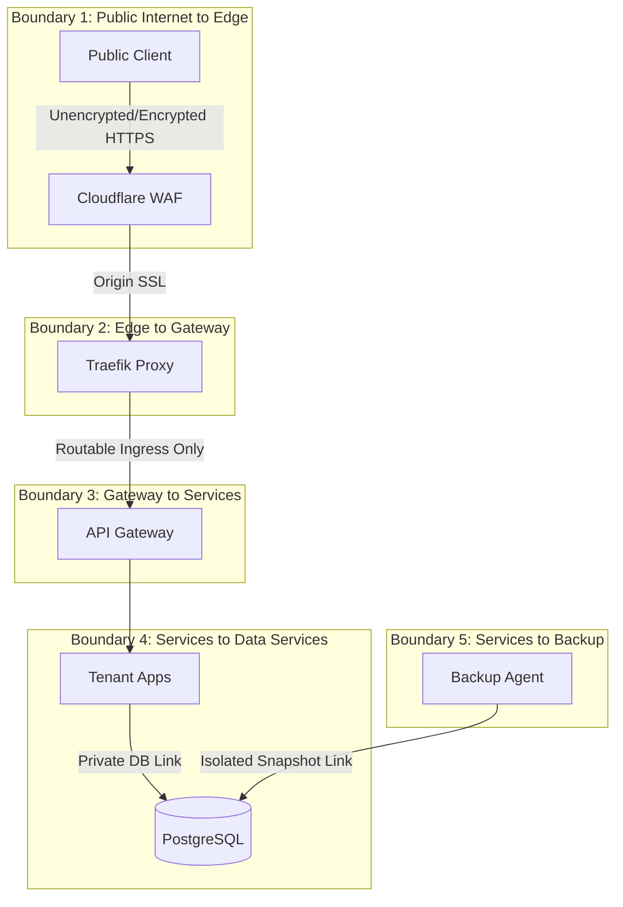

# Network Security Architecture

**Document ID:** ARC-SECURITY-001

**Version:** 1.0

**Status:** Approved

**Classification:** Internal Architecture

**Owner:** Platform Security

**Related Standards:**
- ISS-001
- STD-NETWORK-001
- STD-SECURITY-001
- STD-NAMING-001

---

# 1. Purpose

This document defines the network security architecture of the SJ Cloud Platform. 

It establishes a Zero Trust security posture across all logical networks, delineates trust boundaries, defines proxy security responsibilities, and provides a complete Network Policy Matrix regulating inter-service communications.

---

# 2. Zero Trust Security Model

SJ Cloud operates on a **Zero Trust** networking philosophy: **"Never Trust, Always Verify."** Network locality is not an indicator of trust.

- **Non-Transitive Trust:** Just because Service A is permitted to talk to Service B, and Service B can talk to Service C, Service A is NOT permitted to talk to Service C. Every path must be explicitly allowed.
- **Micro-segmentation:** Workloads are isolated at the network layer using Docker container bridges and Kubernetes NetworkPolicies.
- **Encryption in Transit:** All traffic crossing trust boundaries must be encrypted using TLS 1.2 or TLS 1.3.
- **Least Privilege Bindings:** Containers expose only required ports and attach only to their required networks. Public interface bindings (`0.0.0.0`) are strictly forbidden for databases and internal microservices.

---

# 3. Trust Boundaries

The platform enforces clear trust boundaries between its operating layers. Every boundary transition has validation checkpoints.

### 3.1 Trust Boundary Definitions

| Boundary | Transition | Security Controls | Trust Assumption |
| :--- | :--- | :--- | :--- |
| **Boundary 1** | Internet → Cloudflare | DDoS shields, WAF filters, geo-blocking, TLS termination. | Clients are untrusted. Any payload may be hostile. |
| **Boundary 2** | Cloudflare → Traefik | Host firewall (UFW) blocking non-Cloudflare IPs, Origin TLS certificates. | Cloudflare edge is trusted to filter Layer 7 attacks. |
| **Boundary 3** | Traefik → API Gateway | Internal Docker DNS, HTTP-only bridge, header validation. | Traefik is trusted to route requests correctly matching hosts. |
| **Boundary 4** | API Gateway → Apps | JWT validation, dynamic tenant context mapping (Tenant Registry). | API Gateway is trusted to authenticate and isolate tenant requests. |
| **Boundary 5** | Tenant Apps → Databases | Password-authenticated connection pools, private Docker network isolation. | Databases trust only requests originating from authenticated app schemas. |
| **Boundary 6** | Databases → Backups | Segregated backup network (`sj-backup`), encrypted file systems, read-only system users. | Backups run out-of-band and are write-once, read-never without keys. |

---

# 4. Proxy Responsibilities

Edge security and routing are divided between Cloudflare (CDN/Edge Protection) and Traefik (Internal Proxy/Gateway).

### 4.1 Cloudflare (Global Edge)
- **DNS Resolution:** Fast, secure Anycast DNS.
- **Edge TLS Termination:** Serves public certificates, supports TLS 1.3, rejects obsolete TLS versions (< 1.2).
- **WAF Rules:** Blocks common web vulnerabilities (SQLi, XSS, CSRF, OWASP Top 10).
- **DDoS Mitigation:** Absorbs volumetric Layer 3/4 attacks.
- **Rate Limiting:** Protects platform API routes from brute-force requests.

### 4.2 Traefik (Host Gateway)
- **Dynamic Routing:** Binds dynamically to Docker/Kubernetes API to route traffic based on labels.
- **ACME Certificate Management:** Obtains and auto-renews Let's Encrypt certificates for tenant custom domains.
- **Internal Load Balancing:** Distributes requests evenly across healthy application containers.
- **Header Injection:** Appends standard tracing headers (`X-Request-ID`, `X-Forwarded-Proto`).

---

# 5. Network Policy Matrix

The following matrix defines the authoritative communication permissions across the platform. Any connection path not explicitly marked as allowed must be blocked.

| Source Service | Destination Service | Allowed | Reason |
| :--- | :--- | :--- | :--- |
| **Internet** | Cloudflare | **Yes** | Public entry point for all web traffic. |
| **Internet** | Traefik | **No** | Bypasses Cloudflare edge shield; blocked by UFW firewall rules. |
| **Internet** | PostgreSQL | **No** | Database port `5432` is restricted to local network; never exposed. |
| **Cloudflare** | Traefik | **Yes** | Authorized origin proxy connection. |
| **Traefik** | API Gateway | **Yes** | Gateway routes public API traffic to the gateway middleware. |
| **API Gateway** | Auth | **Yes** | Internal API call to verify tenant user sessions. |
| **API Gateway** | Tenant Apps | **Yes** | Routes requests to targeted tenant application containers. |
| **Auth** | Redis | **Yes** | Identity token and session cache read/write operations. |
| **Applications** | Redis | **No** | Applications must not directly access the central platform cache. |
| **Tenant Apps** | PostgreSQL | **Yes** | Relational queries for tenant business data. |
| **Tenant Apps** | MinIO | **Yes** | Reads and writes files to the tenant's storage bucket. |
| **Prometheus** | Tenant Apps | **Yes** | Scrapes `/metrics` telemetry data on the `sj-monitoring` network. |
| **Prometheus** | PostgreSQL | **No** | Prometheus must scrape database metrics via PG Exporter, not directly. |
| **Backup Agent** | PostgreSQL | **Yes** | Reads data via `pg_dump` for scheduled cron archives. |
| **Backup Agent** | MinIO | **Yes** | Uploads compressed, encrypted backup files to storage. |

---

# 6. Data Protection & Encryption

- **Encryption at Rest:** Databases and MinIO storage volumes use underlying encrypted filesystems (LUKS or AWS KMS in production).
- **Secrets Management:** Environment variables containing passwords, JWT keys, and API tokens are injected dynamically at runtime via Docker Secrets or Kubernetes Secrets, never committed to git repositories.

---

# Revision History

| Version | Date | Description | Author |
| :--- | :--- | :--- | :--- |
| 1.0 | 2026-07-30 | Initial architecture release | Platform Security |

---

**Owner:** Platform Security  
**Approved by:** Platform Architecture Board  
© SJ Cloud Platform Engineering. All Rights Reserved.
