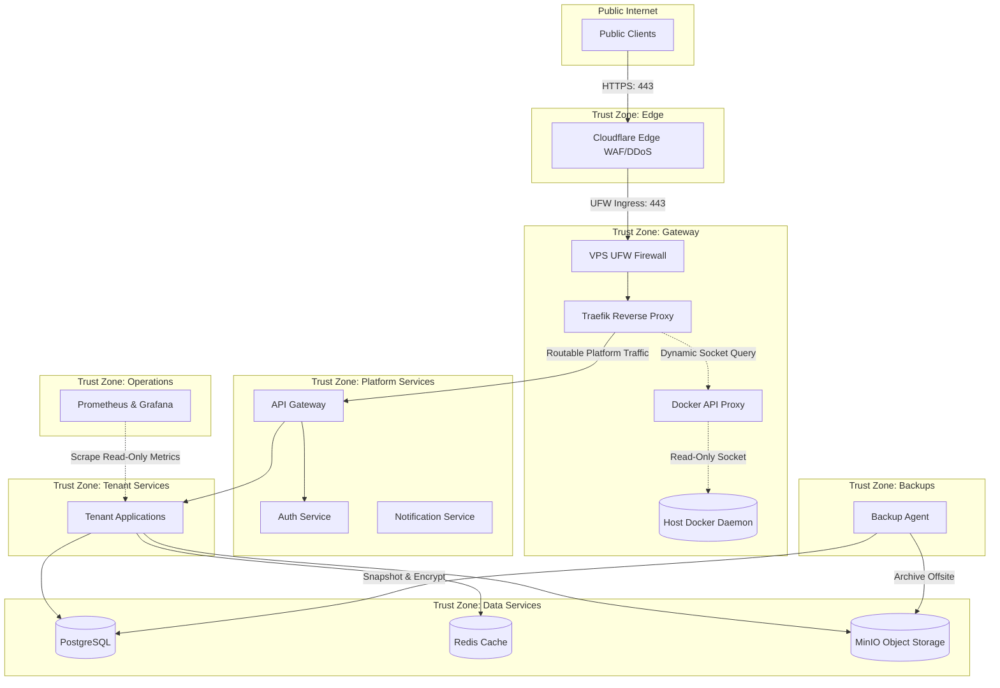
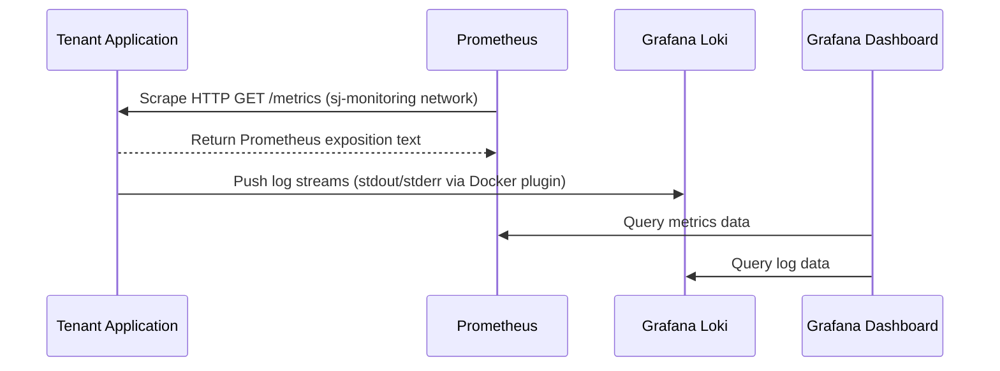
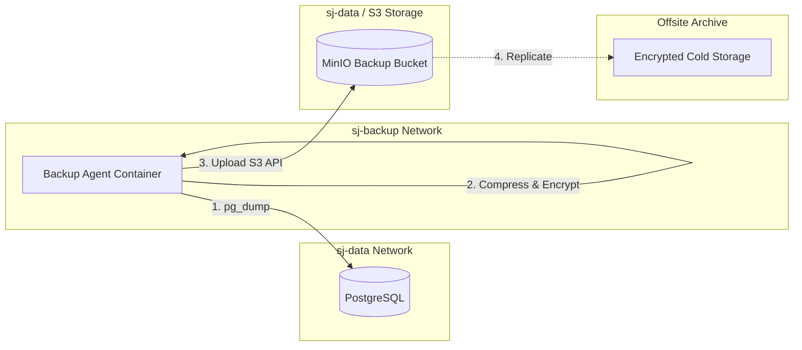

# Network Topology

**Document ID:** ARC-NETWORK-001

**Version:** 1.1

**Status:** Approved

**Classification:** Internal Architecture

**Owner:** Platform Engineering

**Related Standards:**
- ISS-001
- STD-NETWORK-001
- STD-SECURITY-001
- STD-NAMING-001

---

# 1. Purpose

This document defines the logical and physical network topology of the SJ Cloud Platform. 

It details how traffic enters the platform, how services are isolated, and how the networking model transitions from a local VPS environment to a multi-node, Kubernetes-orchestrated cluster without modifying the applications' logical relationships.

---

# 2. Networking Objectives

The network topology enforces the following platform design objectives:
- **Zero Ingress Bypass:** No internal service (other than the edge proxy) can be reached directly from the Internet.
- **Strict Host Isolation:** Applications, databases, and operational pipelines exist on segregated networks.
- **Service-Scoped Trust:** Trust is not transitive. Access is restricted to explicit source-destination connections.
- **Unified Observability Scrapes:** Centralized monitoring agents pull metrics via read-only endpoints without exposing administrative dashboards.
- **Kubernetes Readiness:** Logical Docker network segmentation maps cleanly to Kubernetes Namespaces and NetworkPolicies.

---

# 3. Trust Zones & Boundaries

The platform is structured into distinct, nested Trust Zones. Transition between zones is governed by firewalls, proxies, and API Gateways.



---

# 4. Logical Network Segmentation (Docker Networks)

SJ Cloud segments workloads using six purpose-scoped Docker bridge networks. Containers are attached only to the minimum set of networks required to fulfill their function.

| Network Name | Purpose | Ingress Rules | Egress Rules | Connected Services |
| :--- | :--- | :--- | :--- | :--- |
| **`sj-edge`** | Direct edge ingress from Cloudflare | Ports 80, 443 from Internet | Port 80/443 to `sj-proxy` | Traefik |
| **`sj-proxy`** | Routing zone | Only Traefik ingress | To API Gateway and routable platforms | Traefik, API Gateway, Status Page, Docker Proxy |
| **`sj-services`** | Application runtime | Only API Gateway ingress | To `sj-data`, `sj-services` | API Gateway, Tenant Apps, Shared Services |
| **`sj-data`** | Persistent storage | Only from `sj-services` or `sj-backup` | None (fully isolated) | PostgreSQL, Redis, MinIO |
| **`sj-monitoring`** | Observability scraping | Only Prometheus egress scrapes | None | Prometheus, Loki, Grafana, Node Exporter |
| **`sj-backup`** | Database and storage backups | From backup scheduler | To MinIO (`sj-data`) and offsite | Backup agent scripts |

---

# 5. Ingress & Inbound Request Flow

Every public request follows a strict path from the client browser to the tenant backend application:

1. **Client Browser:** Initiates a request to a platform or tenant domain (e.g., `tenant.startupjigawa.com` or `custom-domain.org`).
2. **Cloudflare Edge:**
   - Resolves DNS and terminates public TLS.
   - Enforces DDoS protection and runs Web Application Firewall (WAF) rule sets.
   - Forwards the clean request over an encrypted Origin connection to the VPS.
3. **VPS Host Firewall (UFW):**
   - Drops all traffic except SSH (restricted IP ranges) and ports 80/443.
4. **Traefik Proxy (`sj-edge` & `sj-proxy`):**
   - Terminates TLS using Let's Encrypt certificates (if bypassed by Cloudflare in dev/staging).
   - Queries docker configuration dynamically via the internal `docker-api-proxy` translation layer.
   - Dynamically routes requests matching host headers to the API Gateway.
5. **API Gateway (`sj-services`):**
   - Parses headers, authenticates requests, and queries the Tenant Registry.
   - Binds the request to the tenant's execution context.
   - Routes the request via Docker DNS to the dedicated tenant application container (e.g., `http://startup-jigawa-app`).

---

# 6. Observability Pipeline Path

Metrics and log collection run on the segregated `sj-monitoring` network. This ensures monitoring traffic does not compete with runtime application bandwidth.



---

# 7. Backup & Restore Architecture

The backup pipeline runs on the isolated `sj-backup` network. Backup actions are scheduled and run out-of-band to prevent database connection exhaustion during peak traffic hours.



---

# 8. Kubernetes Compatibility & Migration Plan

As the platform transitions from Docker Compose (Phase 1 & 2) to Kubernetes (Phase 4), the networking boundaries map directly to Kubernetes-native structures without structural revisions.

### 8.1 Docker to Kubernetes Resource Mapping

| Docker Concept | Kubernetes Equivalent | Implementation Method |
| :--- | :--- | :--- |
| **Docker Network** | Kubernetes Namespace | Logical separation using namespaces: `sj-system`, `sj-services`, `tenant-<slug>`. |
| **Docker DNS (`http://auth`)** | CoreDNS Service Names | Target services using `<service>.<namespace>.svc.cluster.local`. |
| **Bridge Isolation** | Network Policies (`NetworkPolicy`) | Define Ingress/Egress labels restricting pod-to-pod IP communications. |
| **Traefik Proxy** | Ingress Controller | Deploy Traefik Ingress Controller matching CRDs. |
| **Docker Volumes** | PersistentVolumeClaims (PVC) | Map database storage to dynamic storage classes (e.g., EBS, CSI driver). |

### 8.2 Kubernetes Network Policy Outline

Under Phase 4, a default-deny ingress policy is applied to all namespaces. Explicit policies are configured as follows:

```yaml
apiVersion: networking.k8s.io/v1
kind: NetworkPolicy
metadata:
  name: allow-database-from-app
  namespace: sj-data
spec:
  podSelector:
    matchLabels:
      app: postgresql
  ingress:
  - from:
    - namespaceSelector:
        matchLabels:
          kubernetes.io/metadata.name: sj-services
      podSelector:
        matchLabels:
          app.kubernetes.io/part-of: tenant-apps
    ports:
    - protocol: TCP
      port: 5432
```

---

# 9. Docker Compose Implementation

In Phase 1 and 2, the network boundaries are implemented using a single Docker Compose network file:

- **Location:** `infrastructure/compose/00-network.yml`
- **Subnets:** Assigned under `172.20.0.0/16` as non-overlapping `/24` subnets (`172.20.0.0/24` to `172.20.5.0/24`).
- **Internal Flags:** All internal networks (`sj-proxy`, `sj-services`, `sj-data`, `sj-monitoring`, `sj-backup`) set the `internal: true` property to prevent direct outbound internet access.
- **Labels:** Standardized metadata labels are attached to every network for automation and tracing.

---

# Revision History

| Version | Date | Description | Author |
| :--- | :--- | :--- | :--- |
| 1.0 | 2026-07-29 | Initial release placeholder | Platform Engineering |
| 1.1 | 2026-07-30 | Expanded topologies, flow details, and K8s mapping | Platform Engineering |
| 1.2 | 2026-07-30 | Documented Docker Compose implementation file | Platform Engineering |
| 1.3 | 2026-07-30 | Hardened Docker Socket isolation with standalone docker-api-proxy | Platform Engineering |
| 1.4 | 2026-08-01 | Integrated Milestone 8 Application Runtime & Deployment Engine | Platform Engineering |

---

**Document Version:** 1.4

**Owner:** Platform Engineering  
**Approved by:** Platform Architecture Board  
**Approved by:** Security Architecture Committee  
© SJ Cloud Platform Engineering. All Rights Reserved.