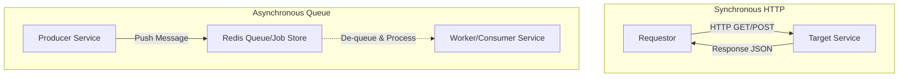

# Service Communication Architecture

**Document ID:** ARC-COMMUNICATION-001

**Version:** 1.1

**Status:** Approved

**Classification:** Internal Architecture

**Owner:** Platform Engineering

**Related Standards:**
- ISS-001
- STD-NETWORK-001
- STD-SECURITY-001
- STD-DEPLOYMENT-001
- STD-NAMING-001

---

# 1. Purpose

This document defines how services communicate within the SJ Cloud Platform. 

It outlines the communication patterns, routing, service discovery, fault tolerance, and the naming standards required to ensure secure, resilient, and multi-tenant service interactions.

---

# 2. Objectives

The service communication architecture is designed to:
- **Prevent Leakage:** Keep internal communication strictly private, avoiding public internet routing and DNS.
- **Provide Resiliency:** Guarantee service stability using defined timeout and retry policies.
- **Enforce Standardization:** Define a uniform service identity model and standard telemetry endpoints.
- **Guarantee Isolation:** Restrict tenant applications from communicating with unauthorized platform services or other tenants.

---

# 3. Communication Principles

Every internal communication path must follow these architectural guidelines:
- **Internal-Only DNS:** Services MUST interact using logical DNS records resolved by the runtime (e.g., Docker DNS or CoreDNS), never via public DNS or IP addresses.
- **Stateless Requests:** Direct service-to-service calls must be stateless. State resides in the designated databases or key-value caches.
- **Fail Fast:** Systems must drop dead connections quickly to prevent resource exhaustion (e.g., thread pool starvation).
- **Least Privilege Access:** Service connections are restricted to explicit entries in the Network Policy Matrix.

---

# 4. Service Identity Standard

Every platform and tenant service deployed on SJ Cloud must define a structured Service Identity. This metadata standardizes how the service is addressed, monitored, and scaled.

### 4.1 Service Identity Schema

| Metadata Field | Definition | Example Value |
| :--- | :--- | :--- |
| **Service Name** | Logical name of the service | `auth` |
| **Container Name** | Runtime container identifier | `sj-auth` |
| **Internal DNS** | Hostname within the Docker network | `http://auth` |
| **Primary Network** | Segment the service runs on | `sj-services` |
| **Health Endpoint** | Liveness check path | `/health` |
| **Readiness Endpoint** | Traffic acceptance check path | `/ready` |
| **Metrics Endpoint** | Telemetry exposition path | `/metrics` |
| **Dependencies** | Downstream dependencies | `postgres`, `redis` |
| **K8s Service Name** | CoreDNS mapping in Kubernetes | `auth.sj-services.svc.cluster.local` |

---

# 5. Standard Endpoints

Every application and platform service MUST expose the following three standard HTTP endpoints on its primary listening port.

### 5.1 `/health` (Liveness Probe)
- **Purpose:** Indicates whether the container runtime is healthy. If this endpoint fails, the orchestrator restarts the container.
- **Logic:** Fast CPU/Memory check. Must not query heavy downstream databases or third-party APIs to avoid false restarts.
- **Response:** `200 OK` with JSON: `{"status": "healthy"}`.

### 5.2 `/ready` (Readiness Probe)
- **Purpose:** Indicates whether the service is prepared to accept request traffic. If this fails, the proxy stops routing requests to this instance.
- **Logic:** Verifies active database connections, cache availability, and file system write access.
- **Response:** `200 OK` (Ready) or `503 Service Unavailable` (Not Ready) with JSON details of check statuses.

### 5.3 `/metrics` (Telemetry Probe)
- **Purpose:** Exposes internal service metrics to the observability pipeline.
- **Logic:** Exposes counter, gauge, and histogram data in the Prometheus text exposition format (version 0.0.4).
- **Access Control:** Restricted via network configuration (`sj-monitoring`) to scraping agents only.

---

# 6. Communication Patterns

Services interact using two primary patterns based on the immediacy requirements of the operation.

### 6.1 Synchronous Communication (REST / HTTP)
- **Protocol:** HTTP/1.1 or HTTP/2 over TLS (or plain text within secure private Docker bridges).
- **Use Case:** Operations requiring immediate feedback (e.g., authentication check, billing payment capture).
- **Rule:** Never use public URLs. Call the logical container DNS directly:
  - *Correct:* `http://auth/api/v1/verify`
  - *Incorrect:* `https://auth.startupjigawa.com/api/v1/verify`

### 6.2 Asynchronous Communication (Redis Queues)
- **Protocol:** Redis Pub/Sub or list-based queues (e.g., Laravel Horizon queue processing).
- **Use Case:** Decoupled, non-blocking workflows (e.g., email notification sends, audit trail writes, PDF generation).
- **Rule:** The worker container resides on the `sj-services` network, subscribing to a Redis instance hosted on `sj-data`.

### 6.3 Ingress-to-Docker Host Communication (Unix Socket Proxy)
- **Protocol:** HTTP over Unix Domain Sockets (UDS).
- **Use Case:** Dynamic container auto-discovery and ingress routing configuration.
- **Rule:** Traefik is denied direct access to the raw host Docker socket (`/var/run/docker.sock`). Instead, Traefik routes socket queries through a private socket (`/etc/traefik/docker-proxy.sock`) hosted by a standalone `docker-api-proxy` service.
- **Translation:** The proxy intercepts incoming requests, translates legacy pathing (rewriting `/v1.24/` → `/v1.40/`), and forwards the translated queries to the raw read-only host Docker socket.

---

# 7. Fault Tolerance & Resiliency

All service-to-service communication must implement fault tolerance mechanisms to prevent cascading failures.

### 7.1 Timeout Philosophy
To prevent blocking client requests indefinitely, timeouts must be strictly enforced.

- **Connection Timeout:** Maximum time allowed to establish a TCP handshake. Standard: **1.5 seconds**.
- **Read Timeout:** Maximum time allowed for the downstream service to return a response after connection. Standard: **5.0 seconds** (can be adjusted for complex analytical reports).

### 7.2 Retry Strategy
When requests fail due to transient network issues, client services must execute retries.

- **Idempotency Rule:** Retries are ONLY allowed on GET/PUT operations or endpoints explicitly marked as idempotent. Never retry non-idempotent POST requests without transaction tracing tokens.
- **Backoff Algorithm:** Use Exponential Backoff with Jitter to prevent "thundering herd" problems on recovering services.
  
$$\text{Backoff Interval} = \text{Min}(\text{MaxInterval}, \text{BaseInterval} \times 2^{\text{attempt}} + \text{jitter})$$

- **Maximum Retries:** Standard is **3 attempts** before failing gracefully.

### 7.3 Circuit Breaking (Future Phase 4)
In clustered Kubernetes deployments, services should fail fast using Traefik or Service Mesh circuit breakers. If a downstream dependency fails more than 50% of requests over a 10-second window, the circuit opens, immediately returning a local fallback response without executing the call.

---

# Revision History

| Version | Date | Description | Author |
| :--- | :--- | :--- | :--- |
| 1.0 | 2026-07-29 | Initial release placeholder | Platform Engineering |
| 1.1 | 2026-07-30 | Defined Service Identity, endpoints, retry/timeout policies | Platform Engineering |
| 1.2 | 2026-07-30 | Added Docker API Proxy connection details | Platform Engineering |
| 1.3 | 2026-08-01 | Integrated Milestone 8 Application Runtime & Deployment Engine | Platform Engineering |

---

**Document Version:** 1.3

**Owner:** Platform Engineering  
**Approved by:** Platform Architecture Board  
**Approved by:** Security Architecture Committee  
© SJ Cloud Platform Engineering. All Rights Reserved.