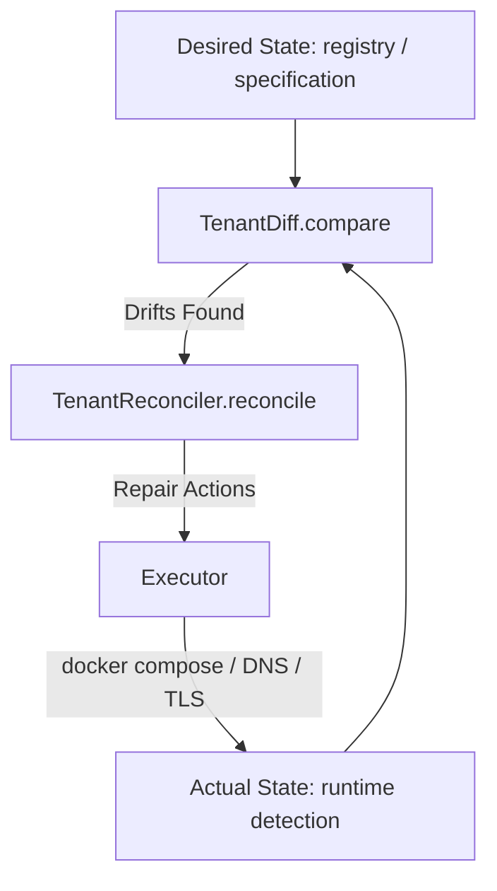

# Tenant Lifecycle Hardening & Orchestration Architecture

This document describes the design and implementation of the hardened Tenant Lifecycle & Orchestration Engine for the SJ Cloud Platform.

## 1. Declarative Specifications & Reconciliation Loop

To prevent operational drift, we have separated the tenant state into **Desired State** and **Actual State**.

* **Desired State**: Loaded from the YAML configurations in the central registry.
* **Actual State**: Checked dynamically at runtime by scanning directories, calling `docker compose ps` / `docker inspect`, querying the Postgres catalog for DB schemas/roles, and verifying route configurations.
* **Drift Detection**: `TenantDiff` evaluates desired vs actual states and detects discrepancies (e.g. missing databases, stopped containers, missing routing files).
* **Self-Healing Loop**: The background `Scheduler` runs every 5 seconds, orchestrating `Worker` instances to automatically recover unhealthy tenants or align states.

---

## 2. Transactional Provisioning & Compensation

The tenant provisioning pipeline is structured as an atomic transaction sequence.

### Steps
1. **Workspace Creation**: Allocates project workspace on disk.
2. **Secret Generation**: Creates cryptographic salts, JWT keys, and database passwords.
3. **Database Provisioning**: Safely provisions dedicated Postgres schema and user role.
4. **Environment Setup**: Registers the state metadata.
5. **Compose Generation**: Emits matching docker-compose file.
6. **DNS & Routing**: Creates Traefik dynamic routing rules.
7. **Certificate Generation**: Issues development TLS certificates.
8. **Container Startup**: Spins up the container services.
9. **Health Verification**: Asserts service availability.

### Rollback (Compensation)
If any step fails, the `TransactionRunner` aborts execution and triggers the completed steps in reverse order (using `compensate(context)`) to ensure zero-resource leak cleanups.

---

## 3. Policy Engine

All operations are gated by a policy-evaluation engine before execution.

* **Quota Policy**: Enforces limits on total active tenants (max 20) and memory/resource bounds depending on plan tiers.
* **Security Policy**: Audits passwords, JWT key lengths, and ID syntax rules.
* **Routing Policy**: Prevents domain collisions.
* **Backup Policy**: Asserts standard cron schedules and retention periods (1-365 days).

---

## 4. Diagnostics & Observability APIs

The admin API is extended with the following diagnostic and monitoring routes:

* `GET /admin/tenants`: List tenant status summaries.
* `GET /admin/tenants/{id}`: Detailed specification and active queue tasks.
* `GET /admin/tenants/{id}/audit`: Access the immutable audit ledger.
* `GET /admin/tenants/{id}/events`: Read FSM state history.
* `GET /admin/tenants/{id}/runtime`: Get low-level Docker container logs/status.
* `GET /admin/tenants/{id}/routing`: Introspect Traefik routing rules.
* `GET /admin/tenants/{id}/health`: Run on-demand watchdog check.
* `GET /admin/tenants/{id}/metrics`: Prometheus metric format outputs.
* `POST /admin/tenants/{id}/reconcile`: Trigger manual reconciliation.
* `POST /admin/tenants/{id}/rollback`: Revert to a previous snapshot version.
