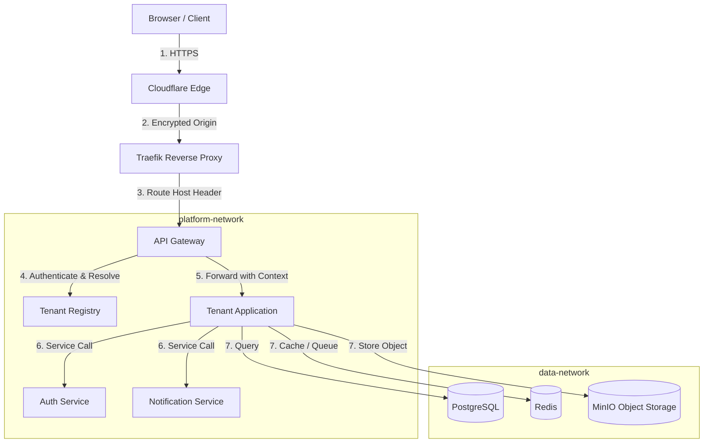
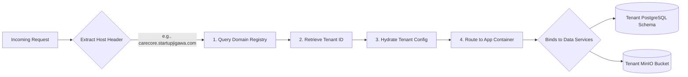
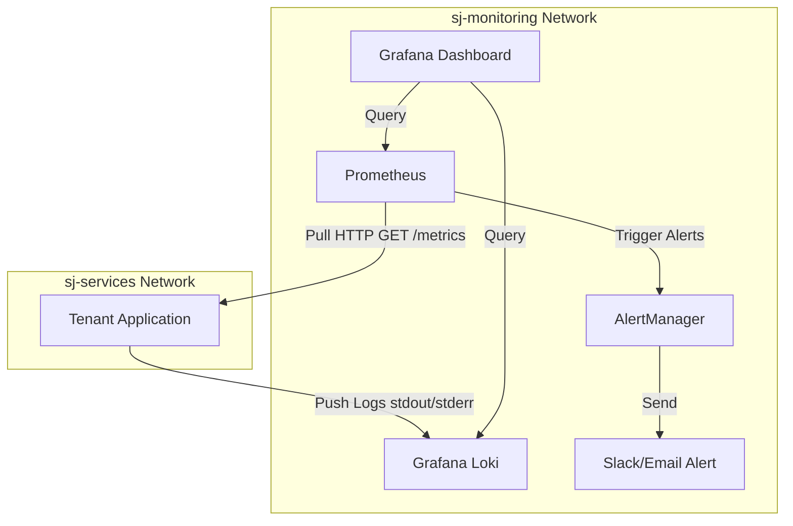
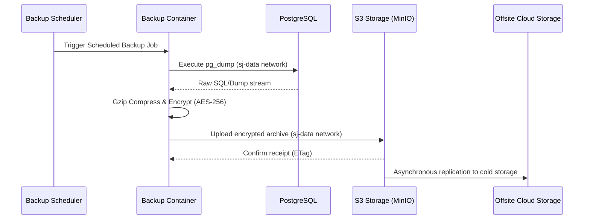

# Traffic Flow Architecture

**Document ID:** ARC-TRAFFIC-001

**Version:** 1.0

**Status:** Approved

**Classification:** Internal Architecture

**Owner:** Platform Engineering

**Related Standards:**
- ISS-001
- STD-NETWORK-001
- STD-SECURITY-001
- STD-NAMING-001

---

# 1. Purpose

This document defines the request lifecycle and data flow models within the SJ Cloud Platform. 

It maps the end-to-end traversal of a client request from the browser to the application code and back, explaining the cross-cutting policies (security, routing, telemetry) applied at each hop. It also defines the platform's core data storage backup and logging pipelines.

---

# 2. Ingress Traffic Flow (Request Lifecycle)

Every incoming HTTP request traverses a series of layers that apply routing, security, and transformation before reaching the tenant code.

### 2.1 Step-by-Step Path Detail

1. **Client to Cloudflare:** Client issues HTTPS request. Cloudflare checks SSL, runs WAF rules, and performs rate limiting.
2. **Cloudflare to Traefik:** Cloudflare proxies requests to the active VPS IP over TLS.
3. **Traefik to API Gateway:** Traefik checks routing rules and forwards traffic matching the host header to the API Gateway container on the `sj-proxy` network.
4. **API Gateway to Tenant Registry:** The gateway interceptor runs. It reads the `Host` header and queries the Tenant Registry database to resolve the tenant context.
5. **API Gateway to Application:** The gateway appends headers (`X-Tenant-ID`, `X-Tenant-Database`, `X-Tenant-Storage-Bucket`) and forwards the request to the specific tenant application container.
6. **Application to Shared Services:** The tenant application handles business logic. If it requires shared operations, it makes service calls via internal DNS (e.g., `http://auth`, `http://notification`).
7. **Application to Database/Storage:** The application accesses the database (using tenant-specific credentials), cache (via tenant prefix key), or S3 (via tenant bucket prefix) on the isolated `sj-data` network.
8. **Response Path:** The application returns a response through the Gateway and Traefik back to the client.

---

# 3. Tenant Resolution Model

Tenant isolation is enforced dynamically at the API Gateway. The platform resolves tenants using database metadata instead of compiling static routes or hardcoding subdomains.

### 3.1 Tenant Resolution Context Variables
Once resolved, the API Gateway injects context headers into downstream requests:
- `X-Tenant-ID`: The unique identifier (e.g., `carecore`).
- `X-Tenant-State`: Active, suspended, or maintenance.
- `X-Tenant-DB-Schema`: Schema identifier within the shared PostgreSQL instance.
- `X-Tenant-Storage-Bucket`: Target MinIO bucket identifier.

---

# 4. API Gateway Responsibilities

The API Gateway is the central enforcement point for all platform traffic policies. It is built as a highly optimized proxy service with the following duties:

- **Authentication:** Validates incoming Bearer JWT tokens. Translates user tokens to internal service credentials.
- **Tenant Resolution:** Maps Host headers to active tenant metadata profiles. Drops requests to suspended tenants.
- **Routing:** Rewrites path parameters and proxies traffic to the targeted internal service containers.
- **Rate Limiting:** Enforces quotas per tenant plan (e.g., maximum 100 requests/minute for basic tier).
- **Observability Logging:** Emits structured JSON access logs containing response latency, status codes, and tenant contexts.
- **API Versioning:** Routes requests based on path headers (`/api/v1` vs `/api/v2`) or request headers.
- **Payload Validation:** Inspects request body sizes and JSON formats to block large or malicious payloads.

---

# 5. Observability Pipeline Flow

All containers publish metrics and logs through isolated routes directly into the operational database.

- **Metrics Pipeline:** Prometheus periodically pulls the `/metrics` endpoint of each service via the `sj-monitoring` network. Metrics are visualized in Grafana. If thresholds are breached, Prometheus fires alerts to AlertManager.
- **Logging Pipeline:** Application containers emit structured JSON logs to `stdout`/`stderr`. The Docker logging driver forwards these logs directly to Loki. Developers view aggregate logs in Grafana.

---

# 6. Database Backup Pipeline Flow

Backups are executed out-of-band on a daily cron schedule to prevent database resource exhaustion.

---

# Revision History

| Version | Date | Description | Author |
| :--- | :--- | :--- | :--- |
| 1.0 | 2026-07-30 | Initial architecture release | Platform Engineering |

---

**Owner:** Platform Engineering  
**Approved by:** Platform Architecture Board  
© SJ Cloud Platform Engineering. All Rights Reserved.
