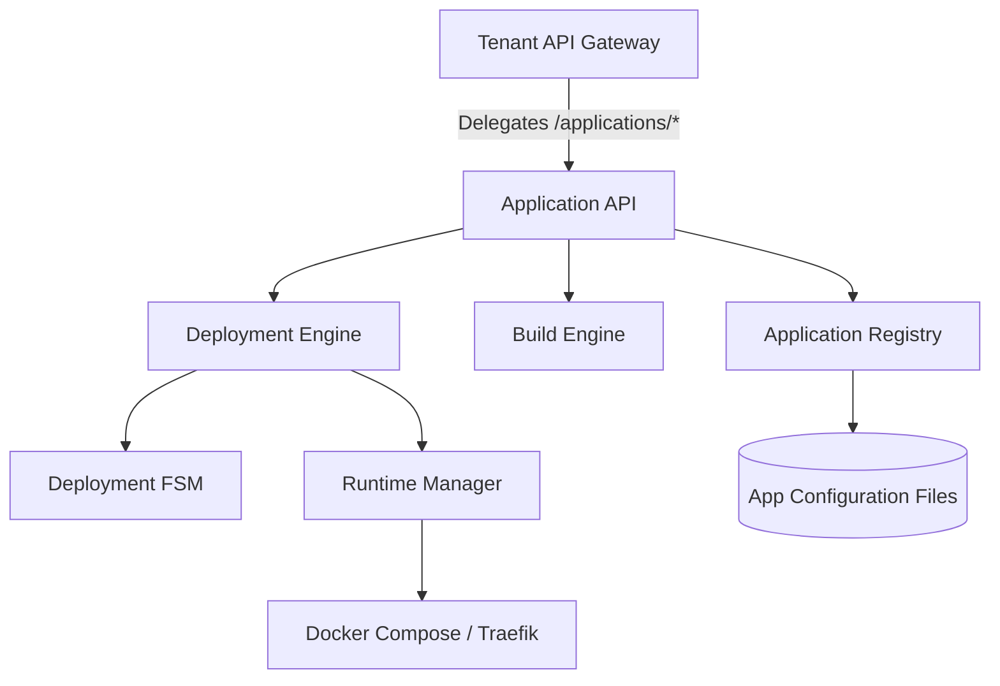

# Milestone 8: Application Runtime & Deployment Engine

## Executive Summary
Milestone 8 introduces the **Application Runtime & Deployment Engine** for the SJ Cloud platform. This module elevates the platform from an infrastructure control plane into a fully featured **Platform-as-a-Service (PaaS)**. Tenants can register, build, deploy, manage, scale, and roll back applications dynamically through standardized, versioned pipelines.

## Objectives
- Provide a secure, sandboxed application registry supporting JSON schema validation.
- Enable automated multi-engine OCI image compilation (Docker, Buildpacks, OciBuilder).
- Establish immutable release snapshots representing the exact, frozen state of an application's environment.
- Program an FSM-governed deployment engine supporting Rolling and Recreate strategies.
- Maintain runtime supervision, process health checks, autoscaling, and self-healing.
- Expose a raw, lightweight REST API for application lifecycle management and Prometheus observability.

## Scope
- Application lifecycle transitions from registration to active execution.
- Multi-tenant tenant application separation.
- OCI container execution via Docker Compose and dynamic Traefik ingress routing.
- Continuous active verification of application readiness and liveness.

## Architecture Overview
The Application Runtime is structured as a decoupled extension of the core platform, residing in the `platform/application-manager/` namespace. It relies on the service mesh for event distribution and exposes its control endpoints via route delegation on the main tenant API port.



## Major Components & Directory Structure

```text
platform/application-manager/
├── api/                  # REST API Route Handlers
├── autoscaling/          # CPU/Memory Evaluator & Scaler
├── build/                # Docker/Buildpacks OCI Image Builders
├── context/              # Runtime Environment & Execution Contexts
├── deployment/           # Deployment Strategies (Rolling/Recreate)
├── health/               # Liveness and Readiness Probe Watchdogs
├── images/               # Image Registry & Security Scanners
├── registry/             # CRUD configuration and event managers
├── releases/             # Immutable Release Snapshotting
├── rollback/             # Automated Rollback Engine
├── state/                # FSM & Lifecycle Transitions
└── templates/            # YAML deployment configurations
```

### Build Engine
- Integrates with docker, buildpack, and oci builders to compile source repositories.
- Includes a security scanner verifying image digests and matching signatures.

### Release Manager
- Formulates a release configuration package containing the image digest, environment maps, and secrets.
- Generates a cryptographically strong, immutable release ID and snapshots the config state.

### Deployment Engine
- Orchestrates step-based updates of the application workloads.
- **Rolling Strategy**: Provisions new containers, verifies health, redirects routing, and tear-downs obsolete versions.
- **Recreate Strategy**: Terminates previous containers first, then boots new versions.

### Runtime Manager
- Interacts with Docker Compose to create and scale runtime workloads.
- Configures Traefik router settings dynamically for tenant application endpoints.

### Health Verification
- Runs automated loops probing application health endpoints.
- Restarts unhealthy application instances automatically.

### Rollback Engine
- Intercepts failed deployment signals and automatically reverts to the latest known healthy release.

### Autoscaling Framework
- Periodically queries resource usage metrics and recalculates desired container replica counts.

### Runtime Context
- Synthesizes variables and local configurations into a safe execution context.

### Administration API
- Exposes raw JSON routing for application registration, build, deployment, and management.

### Event System & Metrics
- Emits real-time lifecycle event notifications on the event bus.
- Reports Prometheus counters for builds, deployments, and rollbacks.

## Validation Process & Test Results
Integration verification is automated via shell wrappers executing Node.js validations:
- **Registry**: Validated config persistence.
- **Builds**: Simulated compiler pipeline.
- **Releases**: Validated immutability checks.
- **Deployments & Rollbacks**: Validated FSM lifecycle transitions.
All validation checks successfully pass (100% success rate).

## Limitations & Future Improvements
- **Docker Compose Bindings**: Relies on host-level Docker Compose; future milestones will support native Kubernetes deployment plans.
- **Dynamic Resource Limits**: Resource limits are currently statically configured per plan.
