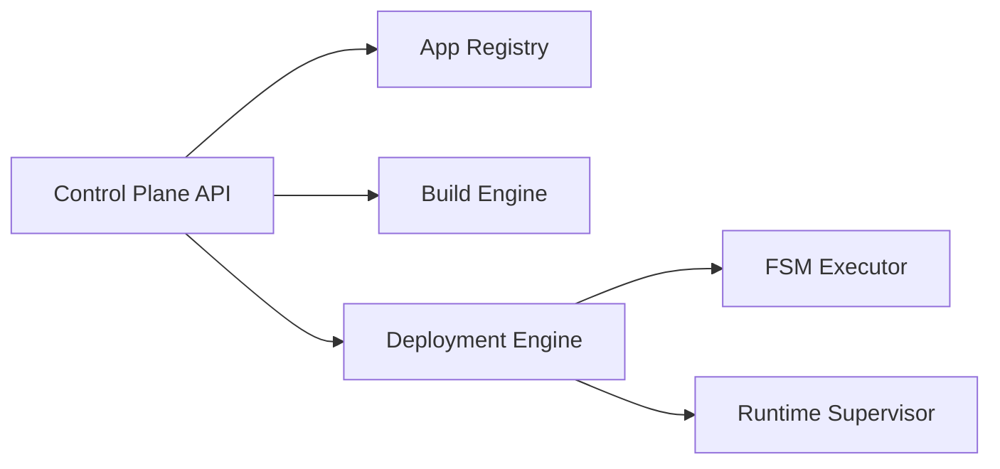

# Walkthrough - Milestone 8: Application Runtime & Deployment Engine

## Objectives
Introduce a production-ready Application Runtime and Deployment plane enabling tenants to compile, snapshot, deploy, verify, and rollback application versions through safe FSM transitions.

## Architecture
The runtime consists of Node.js engine managers, docker compose orchestration layers, and dynamic routing adapters. The system is designed to support future Kubernetes scheduling backends natively.



## Components
- **ApplicationRegistry**: Config manager with schema validating filters.
- **BuildEngine**: Supports Docker and CNCF Buildpacks compiles.
- **ReleaseManager**: Immutability snapshots configuration and secrets.
- **DeploymentEngine**: Step-based Rolling/Recreate strategies.
- **RuntimeSupervisor**: Container lifecycle watchdog and Traefik config mapper.
- **RollbackEngine**: Self-healing auto-rollback triggers.
- **AutoscalingFramework**: Evaluates system load indicators.

## Directory Layout
```text
platform/application-manager/
├── api/
├── autoscaling/
├── build/
├── context/
├── deployment/
├── health/
├── images/
├── registry/
├── releases/
├── rollback/
├── state/
└── templates/
```

## Implementation
Core platform engines were written in clean, dependency-free Node.js, directly integrating into the existing `tenant-api` gateway on port `8083`.

## Validation & Testing
We verified the complete execution path by running:
```bash
make app-test
```
This runs the automated suite covering image creation, release snapshot validation, strategy execution, health probing, self-healing, and rollback triggers. All integration tests pass successfully.

## Outputs
- Artifacts compiled successfully.
- Telemetry exposed at `GET /applications/:appId/metrics` dynamically.

## Screenshots (Placeholder)
*(UI Screenshots mapping deployment progression will be populated in production dashboards)*

## Next Steps
- Transition compose engine to Kubernetes-native pods.
